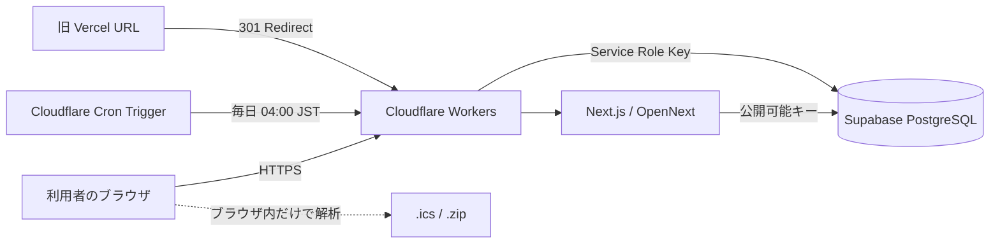

# 日程組（略して日組） / Nittei-gumi

ログイン不要かつ無料で使える、日程調整・出欠管理Webアプリです。主催者が候補日を作ってURLを共有し、参加者は各候補日に `○ / △ / ✕ / -` とコメントで回答できます。

> Production: https://nittei-app.qoj.workers.dev/
>
> Source: https://github.com/tghcgu/nittei-app

[日本語](#japanese) | [English](#english)

---

<a id="japanese"></a>

## 日本語

### 目次

- [サービス概要](#サービス概要)
- [主な機能](#主な機能)
- [重要なURL](#重要なurl)
- [構成](#構成)
- [技術スタック](#技術スタック)
- [データモデル](#データモデル)
- [プライバシーとセキュリティ](#プライバシーとセキュリティ)
- [ローカル開発](#ローカル開発)
- [Supabaseの準備](#supabaseの準備)
- [Cloudflareへのデプロイ](#cloudflareへのデプロイ)
- [運用](#運用)
- [新しいPCへの完全引き継ぎ](#新しいpcへの完全引き継ぎ)
- [バックアップ方針](#バックアップ方針)
- [トラブルシューティング](#トラブルシューティング)
- [ファイル構成](#ファイル構成)

### サービス概要

日程組は、飲み会、会議、イベント、セッション調整などで使える、個人運営の日程調整サービスです。

1. 主催者がイベント名・説明・候補日時を入力します。
2. アプリが `/e/[shareId]` 形式の共有URLを発行します。
3. 参加者はログインせず、共有URLから回答します。
4. 全員の回答を同じページで確認できます。

回答記号の意味はイベント作成者が決められます。一般的な `○ / △ / ✕` に加え、`-` を選んだ候補日には「夕方以降なら可能」「仕事次第」などの日別コメントを残せます。

### 主な機能

#### イベント作成・編集

- ログイン不要でイベントを作成
- イベント名と複数行の説明を登録
- 開始時刻・終了時刻を任意で指定
- 同じ日付に異なる時間帯を複数登録
- 候補日を1件ずつ入力
- 日付範囲から候補日を一括追加
- 月間カレンダーから複数日を選択
- 曜日ごとの一括選択・解除
- 「この月の今日以降」を一括選択
- カレンダー上を長押ししてなぞる範囲選択
- 追加後の自動日付順ソート
- 手動の「日付順に並べ替え」
- ドラッグ＆ドロップによる並べ替え
- 候補日編集の戻る・進む
- 既存イベントの名称・説明・候補日時を編集

#### 回答・集計

- 主催者が選んだ選択肢セットで回答（`○✕` / `○△✕` / `◎○△✕`、既定は `○△✕`）
- どのセットでも使える `-`（その日の状況をメモする用）
- `-` 選択時の日別コメント
- 回答全体へのメモ
- 全候補日を同じ記号にそろえる一括入力
- 入力済みの行を変更しない設定
- 日付範囲・曜日・時間帯を組み合わせた一括回答
- 候補時間と少しでも重なる時間帯をまとめて変更
- マウスまたはスマートフォンの長押し・なぞり入力
- なぞり中の画面端自動スクロール
- 回答入力の戻る・進む
- 回答者単位で既存回答を編集・削除（名前も変更可）
- 入力欄の横に他の人の回答を並べて確認
- 回答一覧の縦表示・横表示切り替え
- 記号ごとの回答数サマリーの表示切り替え
- 候補日の列を横スクロール時に固定する切り替え
- これらの表示設定をブラウザに記憶

#### カレンダーファイル

- `.ics` ファイルを直接読み込み
- Googleカレンダーから書き出された `.zip` をそのまま読み込み
- zip内の複数の `.ics` をまとめて解析
- zip内の誕生日カレンダーをファイル名で自動除外
- 終日予定、時間付き予定、繰り返し予定を解析
- キャンセル済み予定を予定あり判定から除外
- 作成画面では、既存予定と重ならない候補日へ絞り込み
- 回答画面では、予定あり・予定なしに設定する記号を個別指定

カレンダーファイルはブラウザ内だけで処理します。ファイルそのものをSupabaseやCloudflareへ送信・保存する処理はありません。

#### その他

- ライトモード・ダークモード
- 選択したテーマをブラウザの `localStorage` に保存
- 端末内に残る「ページ表示履歴」（`/history`、開いたイベントの一覧）
- ページ下部の「このページについての情報」（表示日時・作成日時・最終更新日時・端末ごとの最終更新・回答人数）
- フッターから支援先（外部サイト）へのリンク
- スマートフォン・PC対応
- イベントページごとの共有用メタデータ
- イベントページは検索結果へ出さない `noindex` 設定
- `robots.txt`、`sitemap.xml`、構造化データ
- Cloudflare Web Analytics
- 最後の更新から365日経過したイベントの自動削除

### 重要なURL

| 用途 | URL | 備考 |
| --- | --- | --- |
| 本番 | https://nittei-app.qoj.workers.dev/ | 現在の正式URL |
| 旧本番 | https://nittei-app-five.vercel.app/ | Vercelから新URLへ301転送するために残す |
| サイトマップ | https://nittei-app.qoj.workers.dev/sitemap.xml | Google Search Consoleへ登録 |
| robots.txt | https://nittei-app.qoj.workers.dev/robots.txt | クロール設定 |
| Google所有権確認 | https://nittei-app.qoj.workers.dev/googlecc8378481687d5f8.html | Search Console用 |
| プライバシー | https://nittei-app.qoj.workers.dev/privacy | 利用者向け |
| 利用規約 | https://nittei-app.qoj.workers.dev/terms | 利用者向け |
| お問い合わせ | https://nittei-app.qoj.workers.dev/contact | `knihud@gmail.com` を案内 |
| ページ表示履歴 | https://nittei-app.qoj.workers.dev/history | 端末内の履歴一覧。`noindex` |

旧Vercelプロジェクトは、Google Search Consoleのアドレス変更と既存リンクの維持に使っています。移行が完全に落ち着くまでは削除しないでください。

### 構成



通常のイベント作成・回答は、ブラウザとSupabaseの間でPublishable Keyを使って行います。古いイベントの削除だけは、Cloudflare Worker上のAPIがService Role Keyを使用します。

### 技術スタック

バージョンの最終的な正確さは `package.json` と `package-lock.json` を優先してください。

| 役割 | 技術 |
| --- | --- |
| 言語 | TypeScript 5 |
| UI | React 19.2.4 |
| フレームワーク | Next.js 16.2.10（App Router） |
| CSS | Tailwind CSS 4 |
| データベース | Supabase（PostgreSQL） |
| 配信 | Cloudflare Workers |
| Next.jsアダプター | OpenNext for Cloudflare 1.20.1 |
| Worker CLI | Wrangler 4.110.0 |
| カレンダー解析 | ical.js 2.2.1 |
| zip展開 | fflate 0.8.3 |
| 並べ替え | dnd-kit |
| アクセス解析 | Cloudflare Web Analytics |
| 旧URL転送 | Vercel |

### データモデル

Supabaseの `public` スキーマに、主に次の4テーブルがあります。

| テーブル | 内容 | 主な列 |
| --- | --- | --- |
| `events` | イベント本体 | `id`, `share_id`, `name`, `description`, `answer_choices`, `created_at`, `updated_at` |
| `candidates` | 候補日時 | `id`, `event_id`, `date`, `time_label`, `sort_order` |
| `responses` | 回答者 | `id`, `event_id`, `name`, `note`, `created_at` |
| `answers` | 候補日ごとの回答 | `id`, `response_id`, `candidate_id`, `value`, `note` |

```text
events
  ├─ candidates
  └─ responses
       └─ answers
```

- `share_id` が共有URLの短いIDです。
- `time_label` には `19:00〜22:00` のような表示用時間帯を保存します。
- `answers.value` は `'◎' | '○' | '△' | '✕' | '-'` に限定しています。TypeScriptの型に加え、DB側にも `answers_value_check` 制約があります。
- `events.answer_choices` は回答の選択肢セットで、`'○✕' | '○△✕' | '◎○△✕'` のいずれかです。既定値は `'○△✕'` で、`events_answer_choices_check` 制約があります。DDLは `supabase/answer-choices.sql` にあります。
- 外部キーは `ON DELETE CASCADE` を使い、親を削除したとき関連データも削除します。
- 実際の型定義は `lib/database.types.ts` を参照してください。

#### データ保持期間

- 保持期間は現在 **最後の更新から365日** です。
- ページを閲覧しただけでは最終更新日時は延長されません。
- イベント、候補日、回答者、回答の追加・更新・削除で `events.updated_at` が更新されます。
- PostgreSQLトリガーは `supabase/auto-delete-old-events.sql` にあります。
- Cloudflare Cron Triggerが毎日 `19:00 UTC`、日本時間の翌日 `04:00` に削除APIを実行します。
- 1回の実行では最大200件 × 20バッチ、合計4,000イベントを処理します。

### プライバシーとセキュリティ

#### 必ず理解しておくこと

このアプリはログイン不要です。イベントURLを知っている人は、そのイベントの内容・回答者名・回答・コメントを閲覧できます。現在のRLSポリシーは、ログインなしの操作を成立させるため、公開ロールに読み書き・一部削除を許可しています。

つまり、**RLSが有効でも、イベントURLを知る人ごとの厳密な編集権限はありません**。URLを知っていれば、イベント名や候補日の編集、他人の回答の編集・削除もできます。機密情報、住所、電話番号、秘密の会議情報などは保存しないでください。イベントページには `noindex` を設定していますが、これはアクセス制御ではありません。

#### ブラウザに保存するもの

サーバーへは送らず、`localStorage` に置いているものが4つあります。

| キー | 内容 |
| --- | --- |
| `nittei-theme` | ライト・ダークの選択 |
| `nittei-history` | 開いたイベントの一覧（`/history` で表示・削除） |
| `nittei-table-prefs` | 集計・見出し固定・縦横の表示設定 |
| `nittei-updated-<shareId>` | その端末で最後に回答した日時 |

いずれもブラウザのデータを消すと消えます。

#### キーの扱い

| 変数 | 公開可否 | 用途 |
| --- | --- | --- |
| `NEXT_PUBLIC_SUPABASE_URL` | 公開可 | SupabaseプロジェクトURL |
| `NEXT_PUBLIC_SUPABASE_PUBLISHABLE_KEY` | 公開可 | ブラウザ用Publishable Key |
| `SUPABASE_SERVICE_ROLE_KEY` | 絶対に非公開 | 自動削除APIだけが使用 |
| `CRON_SECRET` | 絶対に非公開 | 自動削除APIのBearer認証 |

- Service Role Keyを `NEXT_PUBLIC_` で始まる名前にしないでください。
- Service Role Keyをコード、README、Issue、スクリーンショットへ貼らないでください。
- `.env.local` は `.gitignore` で除外されています。
- CloudflareのSecretはクラウドに保存され、Gitには入りません。
- キーを誤って公開した場合は、コミットを消すだけでなくSupabaseまたはCloudflare側で必ずローテーションしてください。

#### RLS

`supabase/rls-policies.sql` で `events`、`candidates`、`responses`、`answers` のRLSを有効化します。現在の設計は利便性優先の公開ポリシーです。将来、編集トークンや認証を導入する場合は、UIだけでなくこのSQLも必ず見直してください。

### ローカル開発

#### 前提条件

- Git
- Node.js `20.9.0` 以上（現在のLTS推奨）
- npm（`package-lock.json` を使用）
- VS Codeなどのエディタ
- Supabaseプロジェクトへのアクセス権
- 本番運用を行う場合はCloudflareアカウントへのアクセス権

Node.jsの最低バージョンは、インストール済みNext.jsの `engines.node` が `>=20.9.0` であることから決まります。

#### 1. リポジトリを取得

Windows PowerShell:

```powershell
cd $HOME\Desktop
git clone https://github.com/tghcgu/nittei-app.git
cd nittei-app
git switch develop
npm.cmd ci
```

macOS / Linux:

```bash
cd ~/Desktop
git clone https://github.com/tghcgu/nittei-app.git
cd nittei-app
git switch develop
npm ci
```

`npm ci` は `package-lock.json` に固定された依存関係を再現します。通常は `npm install` よりこちらを使います。

#### 2. `.env.local` を作る

Windows:

```powershell
notepad .env.local
```

macOS / Linux:

```bash
touch .env.local
```

内容:

```env
NEXT_PUBLIC_SUPABASE_URL=https://YOUR_PROJECT_REF.supabase.co
NEXT_PUBLIC_SUPABASE_PUBLISHABLE_KEY=YOUR_PUBLISHABLE_KEY
```

値はSupabase Dashboardの対象プロジェクトにある接続情報・API Keysから取得します。新しいPCへ移すときは、古いPCの `.env.local` をGitへ入れず、パスワードマネージャーなど安全な場所から復元してください。

過去のメモにある `NEXT_PUBLIC_GOOGLE_CLIENT_ID` と `GEMINI_API_KEY` は、現在のアプリコードから参照されていません。Googleカレンダー直接連携やAI機能を再導入しない限り不要です。

#### 3. 開発サーバーを起動

Windows:

```powershell
npm.cmd run dev
```

macOS / Linux:

```bash
npm run dev
```

ブラウザで http://localhost:3000 を開きます。

#### 4. 変更前後の確認

Windows PowerShell:

```powershell
npm.cmd run lint
.\node_modules\.bin\tsc.cmd --noEmit --pretty false
npm.cmd run build
git status --short
```

macOS / Linux:

```bash
npm run lint
npx tsc --noEmit --pretty false
npm run build
git status --short
```

最低限、次の手動確認も行います。

1. 新しいイベントを作成できる。
2. 発行された共有URLを別タブで開ける。
3. 回答を新規作成・編集・削除できる。
4. 候補日編集で既存回答との整合性が崩れない。
5. `.ics / .zip` を読み込み、予定の重なりが意図どおり判定される。
6. スマートフォン幅で日時欄・回答欄が重ならない。
7. ライト・ダークモードが再読み込み後も維持される。

#### PowerShellでnpmが実行できない場合

Windowsの実行ポリシーにより `npm.ps1 cannot be loaded` と表示されることがあります。設定を無理に変えず、README内のように `npm.cmd` と `npx.cmd` を使えば実行できます。

### Supabaseの準備

#### 既存プロジェクトを新しいPCから使う場合

PCが壊れただけなら、Supabase上のデータは消えません。新しいPCで同じGitHubリポジトリを取得し、同じSupabase URLとPublishable Keyを `.env.local` に戻せば接続できます。

確認項目:

1. Supabase Dashboardへログインできる。
2. `events`、`candidates`、`responses`、`answers` が存在する。
3. Table EditorでRLSが有効になっている。
4. `events.updated_at` が存在する。
5. Database Triggersに更新日時用トリガーが存在する。
6. API KeysでPublishable Keyを取得できる。

#### 新しいSupabaseプロジェクトを作る場合

1. まずテーブルを作成します。初期DDLの参考は `SPEC.md` にあります。
2. `responses.note` と `events.updated_at` を含む、`lib/database.types.ts` と一致するスキーマにします。
3. `supabase/rls-policies.sql` をSQL Editorで実行します。
4. `supabase/auto-delete-old-events.sql` をSQL Editorで実行します。
5. 新しいProject URLとPublishable Keyを `.env.local` に設定します。
6. 新しいService Role KeyをCloudflare Secretへ設定します。

> 注意: `SPEC.md` は初期開発時の履歴資料で、Next.js・ホスティング・一部の列が現在と異なります。完全なクラウド障害から復旧する場合、リポジトリだけを唯一のDBバックアップにせず、Supabaseのスキーマ・データバックアップを別途保持してください。

#### SQLの適用確認

RLS:

```sql
select tablename, rowsecurity
from pg_tables
where schemaname = 'public'
  and tablename in ('events', 'candidates', 'responses', 'answers');
```

更新日時:

```sql
select column_name, data_type, is_nullable
from information_schema.columns
where table_schema = 'public'
  and table_name = 'events'
  and column_name = 'updated_at';
```

### Cloudflareへのデプロイ

#### ローカルのCloudflare環境で確認

```powershell
npm.cmd run preview
```

OpenNext用にwebpackでビルドし、workerd上で http://localhost:8787 を起動します。`.open-next/` は生成物なのでGitへ入れません。

#### 初回または新しいPCでCloudflareへログイン

```powershell
npx.cmd wrangler login
npx.cmd wrangler whoami
```

ブラウザでCloudflareへの認可を完了します。`.wrangler/` の認証状態はPC固有なので、PCを替えたら再ログインが必要です。

#### Secretを確認・再設定

同じCloudflare Workerが残っていれば、PCを替えても登録済みSecretは残ります。Secretの値はCloudflareから読み戻せないため、値を失って再設定が必要な場合は新しい値へローテーションします。

```powershell
npx.cmd wrangler secret list
npx.cmd wrangler secret put SUPABASE_SERVICE_ROLE_KEY
npx.cmd wrangler secret put CRON_SECRET
```

入力したSecretは画面へ表示したり、コマンド履歴へ値ごと書いたりしないでください。

#### 本番デプロイ

```powershell
npm.cmd run lint
.\node_modules\.bin\tsc.cmd --noEmit --pretty false
npm.cmd run deploy
```

`npm run deploy` は次を順番に行います。

```text
Next.js webpack build
  -> OpenNext変換
  -> WranglerでCloudflare Workerへアップロード
```

**このプロジェクトはGitHubへpushしただけでは本番更新されません。** `npm run deploy` を実行したPCからCloudflareへ直接デプロイします。意図せず本番を更新しないよう、実行前に現在のブランチと差分を確認してください。

```powershell
git branch --show-current
git status --short
```

#### ブランチ運用

| ブランチ | 役割 |
| --- | --- |
| `develop` | 開発・確認 |
| `main` | 公開済みソースの基準 |

推奨フロー:

```powershell
git switch develop
git pull --ff-only origin develop
# 実装・確認・コミット
git push origin develop

git switch main
git pull --ff-only origin main
git merge develop
git push origin main

# mainで最終確認後、明示的に本番デプロイ
npm.cmd run deploy
```

マージ競合が起きた場合は、内容を理解せず強制上書きしないでください。

### 運用

#### ログを見る

```powershell
npx.cmd wrangler tail nittei-app
```

終了は `Ctrl+C` です。エラー調査中でも、イベント名・回答者名などの利用者データを公開場所へ貼らないでください。

#### ロールバック

直前のデプロイで障害が出た場合:

```powershell
npx.cmd wrangler versions list
npx.cmd wrangler rollback VERSION_ID
```

`VERSION_ID` は戻したい正常なバージョンのIDへ置き換えます。ロールバック後は本番URLで、トップページ・イベント作成・既存イベント表示を確認します。

#### メンテナンス表示

`custom-worker.mjs` の `MAINTENANCE` を `true` にしてデプロイすると、通常リクエストへ503のメンテナンス画面を返します。Cronは継続します。解除するときは必ず `false` に戻して再デプロイします。

#### 自動削除

- 設定: `wrangler.jsonc` の `triggers.crons`
- Worker入口: `custom-worker.mjs` の `scheduled`
- API: `app/api/cleanup-old-events/route.ts`
- DBトリガー: `supabase/auto-delete-old-events.sql`
- 認証: `Authorization: Bearer <CRON_SECRET>`

保持日数を変更するときは、API内の `RETENTION_DAYS`、利用規約、プライバシーポリシー、READMEの4か所を同時に更新してください。

#### Search Console・SEO

- 正式URLは `lib/site.ts` の `siteUrl` で一元管理しています。
- `app/robots.ts` と `app/sitemap.ts` が検索エンジン向けファイルを生成します。
- `custom-worker.mjs` がGoogle所有権確認HTMLを返します。
- イベントページは回答者名を含むため `noindex` です。
- 旧Vercel URLは `vercel.json` で新URLへ301転送します。
- Search Consoleのサイトマップ欄には `sitemap.xml` を送信します。
- Search Consoleの反映やfavicon更新には数日以上かかることがあります。

### 新しいPCへの完全引き継ぎ

ここが、PCが突然故障した場合の復旧手順です。

#### 何が残り、何が消えるか

| 対象 | PC故障後 | 復旧方法 |
| --- | --- | --- |
| Gitへpush済みのコード | 残る | GitHubからclone |
| commitしていない変更 | 消える可能性が高い | 古いSSDの救出または別バックアップ |
| `.env.local` | Gitには残らない | パスワードマネージャー等から復元 |
| `node_modules` | 消えてよい | `npm ci` で再作成 |
| `.next`, `.open-next` | 消えてよい | build/preview/deployで再作成 |
| Supabaseの本番データ | Supabase側に残る | 同じアカウント・プロジェクトへログイン |
| Cloudflareの本番Worker | Cloudflare側に残る | 同じアカウントへログイン |
| Cloudflare Secret | Cloudflare側に残る | 名前は確認可能、値は読み戻せない |
| Search Console設定 | Googleアカウント側に残る | 同じGoogleアカウントへログイン |
| ダークモード設定 | ブラウザごと | 新PCでは再選択 |
| 未追跡の原稿・画像 | GitHubには残らない | 別バックアップから復元 |

#### 故障前に必ず控えるもの

秘密情報はREADMEへ書かず、パスワードマネージャーなど暗号化された場所へ保存します。

- GitHubアカウントとリポジトリURL
- Cloudflareアカウント、対象Worker名 `nittei-app`
- Supabaseアカウント、Organization名、Project名、Project Ref
- `NEXT_PUBLIC_SUPABASE_URL`
- `NEXT_PUBLIC_SUPABASE_PUBLISHABLE_KEY`
- Service Role Keyの再発行手順
- Cloudflareの `CRON_SECRET` は値を保管するか、失ったら再生成する方針
- Google Search Consoleを管理しているGoogleアカウント
- 各サービスの2段階認証用バックアップコード
- 問い合わせ用メールアカウント

#### 故障した直後の最短復旧手順

1. 新しいPCへGit、Node.js、VS Codeをインストールします。
2. GitHub、Supabase、Cloudflare、Googleへログインできることを確認します。
3. リポジトリをcloneします。
4. `develop` と `main` の両ブランチが見えることを確認します。
5. `.env.local` を安全な控えから復元します。
6. `npm ci` を実行します。
7. lint、typecheck、buildを実行します。
8. `npm run dev` でローカル動作を確認します。
9. `npx wrangler login` でCloudflareへ再ログインします。
10. `wrangler secret list` で必要なSecret名が存在することを確認します。
11. `npm run preview` でCloudflare相当のローカル確認をします。
12. 本番が既に動いているなら、復旧のためだけに再デプロイする必要はありません。
13. 本番更新が必要な場合だけ、差分を確認して `npm run deploy` を実行します。

Windowsでまとめると次の順番です。

```powershell
cd $HOME\Desktop
git clone https://github.com/tghcgu/nittei-app.git
cd nittei-app
git fetch --all --prune
git switch develop
npm.cmd ci
notepad .env.local
npm.cmd run lint
.\node_modules\.bin\tsc.cmd --noEmit --pretty false
npm.cmd run build
npm.cmd run dev
```

ローカル確認後:

```powershell
npx.cmd wrangler login
npx.cmd wrangler whoami
npx.cmd wrangler secret list
npm.cmd run preview
```

#### GitHubにもアクセスできない場合

古いPCや外付けドライブにGitリポジトリが残っていれば、フォルダをコピーするか、事前に作ったGit bundleから復元できます。

バックアップ作成:

```powershell
git bundle create nittei-app-backup.bundle --all
```

復元:

```powershell
git clone .\nittei-app-backup.bundle nittei-app
```

GitHub、古いPC、bundleのすべてがなく、Cloudflareのデプロイ済みWorkerしか残っていない場合、元のTypeScriptソースを完全には復元できません。必ずGitHubへのpushと別媒体のバックアップを続けてください。

#### Supabaseプロジェクト自体を失った場合

PC故障とSupabase障害は別問題です。PCを替えるだけならDBは残りますが、Supabaseプロジェクトを削除した場合は、コードだけでは利用者データを戻せません。

復旧には次が必要です。

1. Supabaseのスキーマバックアップ
2. Supabaseのデータバックアップ
3. RLSポリシー
4. `updated_at` と各トリガー
5. 新しいProject URL・Publishable Key・Service Role Key
6. Cloudflare Secretの更新
7. 再ビルド・再デプロイ

### バックアップ方針

#### 最低限

- 作業終了時に `git status` を確認する。
- 必要な変更をcommitし、GitHubへpushする。
- `.env.local` の値をGit以外の安全な場所へ保管する。
- GitHub、Cloudflare、Supabase、Googleの2FA復旧コードを保管する。

#### 推奨

- 大きな変更前にGitタグまたは明確なコミットを作る。
- 定期的に `git bundle create ... --all` で外付けドライブへ保存する。
- Supabaseのバックアップ機能またはSQL dumpでスキーマとデータを定期保存する。
- 復旧手順を半年に1回、新しい空フォルダで試す。
- 旧Vercel URLの転送とSearch Console所有権を定期確認する。

#### Gitへ入れないもの

- `.env.local`
- `.dev.vars*`
- Service Role Key
- `CRON_SECRET`
- `node_modules/`
- `.next/`
- `.open-next/`
- `.wrangler/`
- `.vercel/`
- 利用者データを含むDB dump（暗号化されていない状態）

### トラブルシューティング

#### `npm.ps1 cannot be loaded`

PowerShellの実行ポリシーです。`npm` ではなく `npm.cmd`、`npx` ではなく `npx.cmd` を使います。

#### Supabase関連の環境変数エラー

`.env.local` の名前を確認し、開発サーバーを再起動します。値の前後に不要な引用符や空白を入れないでください。

```env
NEXT_PUBLIC_SUPABASE_URL=...
NEXT_PUBLIC_SUPABASE_PUBLISHABLE_KEY=...
```

#### イベントページが404になる

- URLの `shareId` が正しいか確認します。
- Supabaseの `events.share_id` に該当行があるか確認します。
- CloudflareログでDB接続エラーが出ていないか確認します。
- 存在しないイベントは意図的に404になります。

#### `npm run preview` が起動しない

- `npm ci` が完了しているか確認します。
- Node.jsが `20.9.0` 以上か確認します。
- 8787番ポートを別プロセスが使用していないか確認します。
- `.open-next` は手で作らず、previewスクリプトに生成させます。

#### Cloudflareへデプロイできない

```powershell
npx.cmd wrangler whoami
```

ログインしていなければ `npx.cmd wrangler login` を実行します。アカウントは正しくてもWorkerが見つからない場合、CloudflareのAccountまたは権限が違う可能性があります。

#### 自動削除が動かない

- `wrangler.jsonc` にCron Triggerがあるか確認します。
- `CRON_SECRET` と `SUPABASE_SERVICE_ROLE_KEY` のSecret名を確認します。
- `events.updated_at` とDBトリガーを確認します。
- `wrangler tail nittei-app` で `cleanup-old-events` のログを確認します。

#### `.ics / .zip` が読めない

- zip内に `.ics` があるか確認します。
- 誕生日カレンダーしか入っていないzipは意図的にエラーになります。
- パスワード付きzipや破損したzipには対応していません。
- ファイルはサーバーに送信されないため、ブラウザのコンソールで解析エラーを確認します。

#### Search Consoleがすぐ更新されない

サイトマップやfavicon、アドレス変更は即時反映ではありません。まず本番URL、`robots.txt`、`sitemap.xml`、所有権確認URLが200を返すことを確認し、その後は再クロールを待ちます。

### ファイル構成

```text
app/
  page.tsx                         イベント作成・編集画面
  layout.tsx                       全体レイアウト、SEO、構造化データ、テーマ初期化
  globals.css                      全体スタイル、レスポンシブ、ダークモード
  ThemeToggle.tsx                  ライト・ダーク切り替えとlocalStorage保存
  robots.ts                        robots.txt生成
  sitemap.ts                       sitemap.xml生成
  icon.png / favicon.ico           サイトアイコン
  contact/page.tsx                 お問い合わせ先
  privacy/page.tsx                 プライバシーポリシー
  terms/page.tsx                   利用規約
  history/page.tsx                 ページ表示履歴（noindex）
  history/HistoryList.tsx          履歴一覧の中身（クライアント側）
  e/[shareId]/page.tsx             イベント取得、動的メタデータ、404判定
  e/[shareId]/ResponsePage.tsx     回答UI、集計、編集、.ics解析、一括操作
  api/cleanup-old-events/route.ts  古いイベントの削除API
lib/
  answer-choices.ts                回答の選択肢セットの定義
  calendar-files.ts                .ics / zip読込、誕生日カレンダー除外
  database.types.ts                Supabaseテーブル型
  history.ts                       ページ表示履歴のlocalStorage読み書き
  site.ts                          サイト名、説明、正式URL、検索キーワード
  supabase.ts                      ブラウザ・サーバー共通Supabaseクライアント
supabase/
  rls-policies.sql                 RLSと公開操作ポリシー
  auto-delete-old-events.sql       updated_at列、更新トリガー
  answer-choices.sql               回答の選択肢セット用の列と制約
custom-worker.mjs                  Cloudflare Worker入口、所有権確認、メンテ、Cron
wrangler.jsonc                     Worker、Assets、Service Binding、Cron設定
open-next.config.ts                OpenNext for Cloudflare設定
next.config.ts                     Next.js standalone出力設定
vercel.json                        旧Vercel URLからの301転送
package.json                       依存関係と開発・ビルド・デプロイスクリプト
package-lock.json                  npm依存関係の固定
SPEC.md                            初期仕様の履歴資料（現状と異なる箇所あり）
HANDOFF.md                         AI・開発引き継ぎメモ
```

### ライセンスと問い合わせ

現在、このリポジトリには `LICENSE` ファイルがありません。明示的な許諾なしに再配布・商用利用できるとはみなさないでください。

不具合・要望: `knihud@gmail.com`

---

<a id="english"></a>

## English

### Overview

Nittei-gumi is a login-free web application for scheduling and attendance coordination. An organizer creates candidate dates, shares the generated URL, and participants answer each candidate with the symbol set the organizer picked, plus optional comments.

The organizer chooses one of `○✕`, `○△✕`, or `◎○△✕` (default `○△✕`) and defines what each symbol means for the event. A `-` option is always available and can carry a per-candidate note such as “available after 18:00” or “depends on work.”

Production: https://nittei-app.qoj.workers.dev/

### Features

#### Event creation and editing

- Create events without an account
- Store an event name and multiline description
- Optional start and end times
- Multiple time slots on the same date
- Add dates individually, by date range, or from a monthly calendar
- Select or clear an entire weekday
- Select every remaining day in the displayed month
- Long-press and drag across calendar dates
- Automatic chronological sorting plus manual sorting
- Drag-and-drop ordering
- Undo and redo candidate changes
- Edit an existing event and its candidate slots

#### Responses

- Response values follow the organizer's choice (`○✕` / `○△✕` / `◎○△✕`, default `○△✕`)
- A `-` value is always available for noting the situation of that day
- Per-candidate comments for `-`
- A shared note for the whole response
- Apply one value to all candidates
- Preserve rows that already have an answer
- Bulk updates by date range, weekday, and overlapping time range
- Mouse and touch drag-paint input
- Edge auto-scroll while painting answers
- Undo and redo response changes
- Edit or delete an existing participant response, including the name
- See other participants' answers beside your own input
- Vertical and horizontal result views
- Toggle the per-symbol count summary
- Toggle pinning the candidate column while scrolling sideways
- Remember these view settings in the browser

#### Calendar files

- Read `.ics` files
- Read Google Calendar export `.zip` files without manual extraction
- Parse multiple `.ics` files inside one zip
- Exclude birthday calendars by filename
- Handle all-day, timed, and recurring events
- Ignore cancelled events
- Filter candidate dates on the organizer screen
- Choose separate response symbols for busy and free slots

Calendar files are parsed entirely in the browser. The original `.ics` or `.zip` file is not uploaded to Supabase or Cloudflare.

#### Other behavior

- Responsive desktop and mobile UI
- Light and dark themes
- Theme persistence in browser `localStorage`
- Per-device page view history at `/history`
- A page information block at the bottom (viewed at, created at, last updated, last update from this device, number of responses)
- A support link to an external site in the footer
- Dynamic metadata for shared event links
- `noindex` on event pages that may contain participant names
- `robots.txt`, `sitemap.xml`, and structured data
- Cloudflare Web Analytics
- Automatic deletion 365 days after the last event activity

### Important URLs

| Purpose | URL | Notes |
| --- | --- | --- |
| Production | https://nittei-app.qoj.workers.dev/ | Canonical URL |
| Legacy production | https://nittei-app-five.vercel.app/ | Kept for 301 redirects |
| Sitemap | https://nittei-app.qoj.workers.dev/sitemap.xml | Submit to Search Console |
| Robots | https://nittei-app.qoj.workers.dev/robots.txt | Crawl policy |
| Google verification | https://nittei-app.qoj.workers.dev/googlecc8378481687d5f8.html | Search Console ownership |
| Privacy | https://nittei-app.qoj.workers.dev/privacy | User-facing policy |
| Terms | https://nittei-app.qoj.workers.dev/terms | User-facing terms |
| Contact | https://nittei-app.qoj.workers.dev/contact | Contact information |
| Page view history | https://nittei-app.qoj.workers.dev/history | Per-device list, `noindex` |

Do not remove the legacy Vercel project while old links and the Google Search Console address migration still depend on its redirect.

### Architecture

```text
Browser
  -> Cloudflare Workers
       -> Next.js through OpenNext
       -> Supabase PostgreSQL

Cloudflare Cron Trigger
  -> Worker scheduled handler
       -> authenticated cleanup API
            -> Supabase with the Service Role Key

Legacy Vercel URL
  -> 301 redirect to Cloudflare
```

Normal user operations use the Supabase Publishable Key. Only the cleanup API uses the Service Role Key.

### Technology stack

Treat `package.json` and `package-lock.json` as the authoritative version source.

| Responsibility | Technology |
| --- | --- |
| Language | TypeScript 5 |
| UI | React 19.2.4 |
| Framework | Next.js 16.2.10, App Router |
| CSS | Tailwind CSS 4 |
| Database | Supabase PostgreSQL |
| Hosting | Cloudflare Workers |
| Next.js adapter | OpenNext for Cloudflare 1.20.1 |
| Worker CLI | Wrangler 4.110.0 |
| Calendar parser | ical.js 2.2.1 |
| Zip extraction | fflate 0.8.3 |
| Sorting | dnd-kit |
| Analytics | Cloudflare Web Analytics |
| Legacy redirect | Vercel |

### Data model

| Table | Purpose | Main columns |
| --- | --- | --- |
| `events` | Event record | `id`, `share_id`, `name`, `description`, `answer_choices`, `created_at`, `updated_at` |
| `candidates` | Candidate date/time | `id`, `event_id`, `date`, `time_label`, `sort_order` |
| `responses` | Participant response | `id`, `event_id`, `name`, `note`, `created_at` |
| `answers` | Answer for one candidate | `id`, `response_id`, `candidate_id`, `value`, `note` |

`candidates` and `responses` belong to an `event`; `answers` connect a `response` to a `candidate`. Cascading foreign keys remove related rows with their parent. The TypeScript representation is in `lib/database.types.ts`.

`answers.value` is limited to `'◎' | '○' | '△' | '✕' | '-'` by the `answers_value_check` constraint. `events.answer_choices` holds the symbol set (`'○✕' | '○△✕' | '◎○△✕'`, default `'○△✕'`) and is guarded by `events_answer_choices_check`. Both statements live in `supabase/answer-choices.sql`.

#### Retention

- Events are deleted 365 days after their last write activity.
- Viewing an event does not refresh its retention clock.
- Database triggers update `events.updated_at` after event, candidate, response, or answer changes.
- Cloudflare runs the cleanup at `19:00 UTC` every day, which is `04:00 JST` the following day.
- One run handles at most 4,000 events in batches.

### Privacy and security

This application intentionally has no login flow. Anyone who knows an event URL can view its event details, participant names, answers, and comments. RLS is enabled, but its current public policies allow the reads and writes required by the no-login design, including selected update and delete operations.

Therefore, **RLS does not provide per-user ownership in the current design**. Anyone with the URL can also edit the event and edit or delete other people's responses. Do not store confidential information. `noindex` reduces search indexing but is not access control.

#### Stored in the browser

Four things stay in `localStorage` and are never sent to the server.

| Key | Contents |
| --- | --- |
| `nittei-theme` | Light or dark choice |
| `nittei-history` | Events opened on this device (listed and clearable at `/history`) |
| `nittei-table-prefs` | Count summary, pinned column, and vertical/horizontal view |
| `nittei-updated-<shareId>` | When this device last answered |

Clearing browser data removes all of them.

| Variable | Exposure | Purpose |
| --- | --- | --- |
| `NEXT_PUBLIC_SUPABASE_URL` | Public | Supabase project URL |
| `NEXT_PUBLIC_SUPABASE_PUBLISHABLE_KEY` | Public | Browser Publishable Key |
| `SUPABASE_SERVICE_ROLE_KEY` | Secret | Cleanup API only |
| `CRON_SECRET` | Secret | Bearer authentication for cleanup |

Never put the Service Role Key under a `NEXT_PUBLIC_` name. Never commit `.env.local`, Service Role Keys, or Cron secrets. If a secret leaks, rotate it at the provider; removing it from the latest commit is not enough.

### Local development

#### Prerequisites

- Git
- Node.js `20.9.0` or newer; use a current LTS release
- npm and the checked-in `package-lock.json`
- Access to the existing Supabase project
- Access to the Cloudflare account for production operations

#### Clone and install

Windows PowerShell:

```powershell
cd $HOME\Desktop
git clone https://github.com/tghcgu/nittei-app.git
cd nittei-app
git switch develop
npm.cmd ci
```

macOS / Linux:

```bash
git clone https://github.com/tghcgu/nittei-app.git
cd nittei-app
git switch develop
npm ci
```

#### Environment variables

Create `.env.local`:

```env
NEXT_PUBLIC_SUPABASE_URL=https://YOUR_PROJECT_REF.supabase.co
NEXT_PUBLIC_SUPABASE_PUBLISHABLE_KEY=YOUR_PUBLISHABLE_KEY
```

Retrieve both values from the target Supabase project. Keep a secure copy outside Git. Legacy notes may mention `NEXT_PUBLIC_GOOGLE_CLIENT_ID` and `GEMINI_API_KEY`; the current source does not use them.

#### Run and verify

Windows:

```powershell
npm.cmd run dev
npm.cmd run lint
.\node_modules\.bin\tsc.cmd --noEmit --pretty false
npm.cmd run build
```

macOS / Linux:

```bash
npm run dev
npm run lint
npx tsc --noEmit --pretty false
npm run build
```

The Next.js development server is available at http://localhost:3000.

If PowerShell blocks `npm.ps1`, use `npm.cmd` and `npx.cmd` instead of changing the machine execution policy.

### Supabase setup

For a new computer using the existing project, no database restore is necessary. Log in to the same Supabase account and recreate `.env.local`.

Verify that:

1. `events`, `candidates`, `responses`, and `answers` exist.
2. RLS is enabled on all four tables.
3. `events.updated_at` exists.
4. The activity triggers are installed.
5. The Publishable Key is available.

For a new Supabase project:

1. Create the base tables, using `SPEC.md` only as a historical starting point.
2. Make the schema match `lib/database.types.ts`, including `responses.note` and `events.updated_at`.
3. Run `supabase/rls-policies.sql`.
4. Run `supabase/auto-delete-old-events.sql`.
5. Update `.env.local`.
6. Replace the Cloudflare `SUPABASE_SERVICE_ROLE_KEY` secret.

`SPEC.md` is not the current operational source of truth. Keep a separate Supabase schema and data backup for full cloud disaster recovery.

### Cloudflare deployment

#### Local Worker preview

```powershell
npm.cmd run preview
```

This builds Next.js with webpack, creates the OpenNext bundle, and starts workerd at http://localhost:8787.

#### Authenticate a new computer

```powershell
npx.cmd wrangler login
npx.cmd wrangler whoami
```

#### Secrets

Existing Worker secrets remain in Cloudflare after a computer replacement, but their values cannot be read back. List secret names or rotate missing values:

```powershell
npx.cmd wrangler secret list
npx.cmd wrangler secret put SUPABASE_SERVICE_ROLE_KEY
npx.cmd wrangler secret put CRON_SECRET
```

#### Production deploy

```powershell
npm.cmd run lint
.\node_modules\.bin\tsc.cmd --noEmit --pretty false
npm.cmd run deploy
```

`npm run deploy` performs a webpack build, OpenNext conversion, and a direct Wrangler upload. **Pushing to GitHub does not deploy production.** Confirm the current branch and working tree before deploying.

The branch convention is:

- `develop`: development and verification
- `main`: released source baseline

### Operations

Live logs:

```powershell
npx.cmd wrangler tail nittei-app
```

Rollback:

```powershell
npx.cmd wrangler versions list
npx.cmd wrangler rollback VERSION_ID
```

Maintenance mode is controlled by `MAINTENANCE` in `custom-worker.mjs`. Set it to `true`, deploy, and later restore it to `false`. The scheduled cleanup continues while maintenance mode is active.

When changing the retention period, update all of the following together:

1. `RETENTION_DAYS` in `app/api/cleanup-old-events/route.ts`
2. `app/privacy/page.tsx`
3. `app/terms/page.tsx`
4. This README

### Complete new-computer recovery

#### What survives a computer failure

| Item | Survives? | Recovery |
| --- | --- | --- |
| Code pushed to GitHub | Yes | Clone the repository |
| Uncommitted local work | Usually no | Recover the disk or another backup |
| `.env.local` | Not in Git | Restore from a password manager |
| `node_modules`, `.next`, `.open-next` | Not needed | Recreate with install/build |
| Supabase production data | Yes | Log in to the same Supabase project |
| Deployed Cloudflare Worker | Yes | Log in to the same Cloudflare account |
| Cloudflare secret values | Stored but unreadable | Keep them or rotate them |
| Search Console configuration | Yes | Log in to the same Google account |
| Browser theme preference | No | Select the theme again |
| Untracked drafts and images | No | Restore from a separate backup |

#### Recovery checklist

1. Install Git, Node.js, and an editor.
2. Verify access to GitHub, Supabase, Cloudflare, and Google accounts.
3. Clone the repository and switch to `develop`.
4. Restore `.env.local` from secure storage.
5. Run `npm ci`.
6. Run lint, typecheck, and build.
7. Run the app at localhost and test event creation and responses.
8. Run `wrangler login` and confirm the account with `wrangler whoami`.
9. Confirm that both required Cloudflare secret names exist.
10. Run the local Worker preview.
11. Do not redeploy only because the computer changed; the existing production Worker keeps running.
12. Deploy only when an actual production change is ready.

Windows command sequence:

```powershell
cd $HOME\Desktop
git clone https://github.com/tghcgu/nittei-app.git
cd nittei-app
git fetch --all --prune
git switch develop
npm.cmd ci
notepad .env.local
npm.cmd run lint
.\node_modules\.bin\tsc.cmd --noEmit --pretty false
npm.cmd run build
npx.cmd wrangler login
npx.cmd wrangler whoami
npx.cmd wrangler secret list
npm.cmd run preview
```

If GitHub is unavailable but an offline Git bundle exists:

```powershell
git clone .\nittei-app-backup.bundle nittei-app
```

Create that bundle in advance with:

```powershell
git bundle create nittei-app-backup.bundle --all
```

A deployed Worker is not a reliable source-code backup. If GitHub, the old disk, and every offline backup are all lost, the original TypeScript project cannot be fully reconstructed from the deployed bundle.

### Backup policy

At minimum:

- Commit and push completed work.
- Keep `.env.local` values in encrypted storage outside Git.
- Keep recovery codes for GitHub, Cloudflare, Supabase, and Google accounts.
- Preserve regular Supabase schema and data backups.
- Keep the legacy Vercel redirect operational during the migration period.

Recommended:

- Create a known-good commit or tag before large releases.
- Periodically create an offline `git bundle`.
- Test the recovery steps from an empty directory twice a year.
- Verify production, redirects, `robots.txt`, `sitemap.xml`, and the cleanup cron after infrastructure changes.

Never commit:

- `.env.local` or `.dev.vars*`
- Service Role Keys or `CRON_SECRET`
- `node_modules/`, `.next/`, `.open-next/`, `.wrangler/`, or `.vercel/`
- Unencrypted database dumps containing user data

### Troubleshooting

- **`npm.ps1 cannot be loaded`:** use `npm.cmd` and `npx.cmd` on Windows.
- **Missing Supabase environment variables:** fix `.env.local` and restart the dev server.
- **Event page returns 404:** check the `shareId`, the `events` row, and Worker logs.
- **Preview fails:** confirm Node `>=20.9.0`, run `npm ci`, and free port 8787.
- **Deployment fails:** run `npx.cmd wrangler whoami`; log in again if required.
- **Cleanup does not run:** verify the Cron Trigger, both Worker secret names, `events.updated_at`, and DB triggers.
- **Calendar import fails:** confirm that the file contains valid `.ics`; password-protected or damaged zips are unsupported.
- **Search Console has stale data:** verify live endpoints first, then allow time for recrawling.

### Repository map

```text
app/page.tsx                         Event create/edit UI
app/e/[shareId]/page.tsx             Event loading, metadata, and 404 handling
app/e/[shareId]/ResponsePage.tsx     Response UI, results, calendar import, bulk actions
app/api/cleanup-old-events/route.ts  Authenticated retention cleanup
app/layout.tsx                       Global metadata, structured data, theme initialization
app/robots.ts                        robots.txt
app/sitemap.ts                       sitemap.xml
app/history/page.tsx                 Per-device page view history (noindex)
app/history/HistoryList.tsx          History list rendering (client side)
lib/answer-choices.ts                Answer symbol sets
lib/calendar-files.ts                .ics/.zip reading and birthday-calendar exclusion
lib/database.types.ts                Supabase table types
lib/history.ts                       Page view history localStorage helpers
lib/site.ts                          Canonical site identity and URL
lib/supabase.ts                      Supabase client
supabase/rls-policies.sql            RLS policies
supabase/auto-delete-old-events.sql  Activity timestamps and triggers
supabase/answer-choices.sql          Answer symbol set column and constraints
custom-worker.mjs                    Worker entry, maintenance mode, verification, cron
wrangler.jsonc                       Worker and scheduled-trigger configuration
open-next.config.ts                  OpenNext Cloudflare adapter configuration
vercel.json                          Legacy URL redirects
```

### License and contact

No `LICENSE` file is currently included. Do not assume redistribution or commercial-use permission without explicit authorization.

Contact: `knihud@gmail.com`
